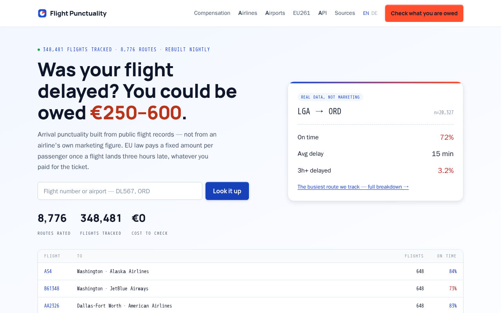
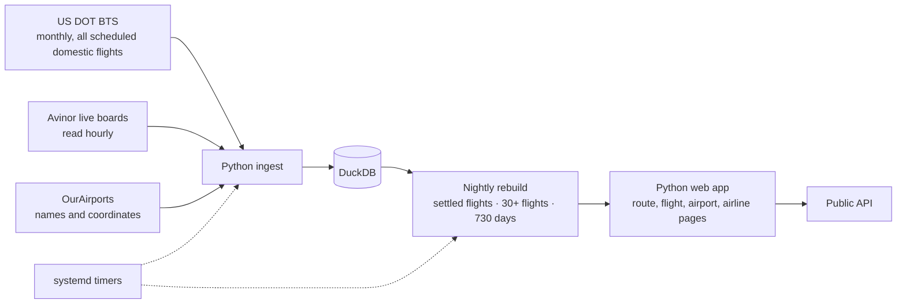
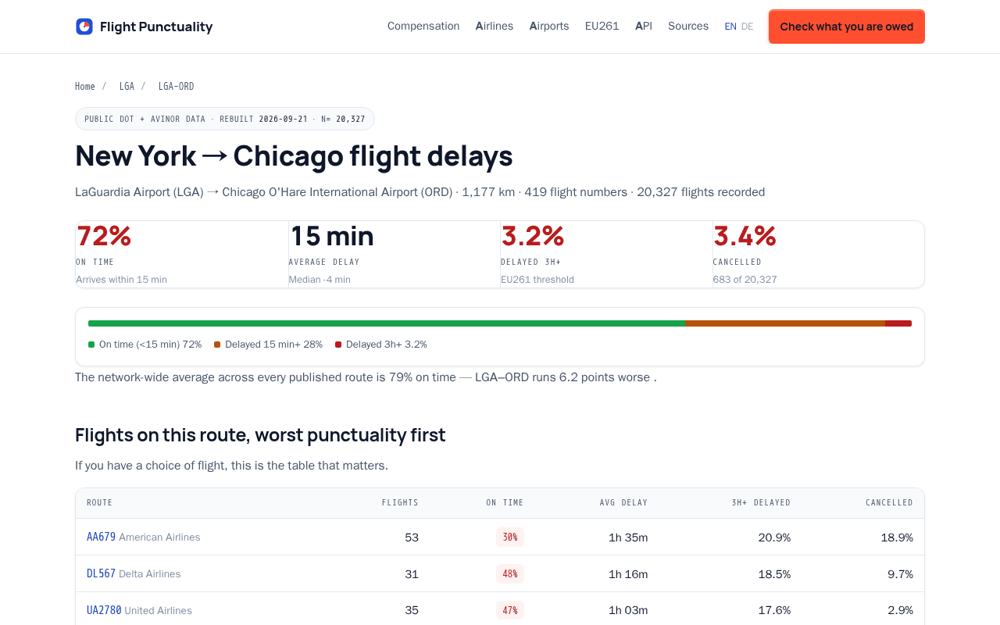
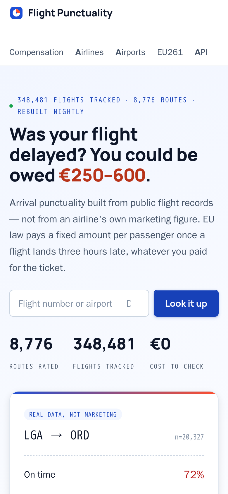

# Flight Punctuality

**How often does a flight or route actually run late — and what does EU261 owe you when it does?** Delay statistics built from public flight records, not from an airline's own marketing figure.

[**flightpunctuality.online →**](https://flightpunctuality.online) &nbsp;·&nbsp; Live in production &nbsp;·&nbsp; Solo project

> The source code is private. This repository is a case study: what the product does, how the data is handled, and why the numbers can be trusted.

## What it does

- **Route and flight pages** — on-time rate, average delay, share of flights delayed 3+ hours, cancellation rate, and a table of every flight number on the route, worst first.
- **Airport, airline and country pages** for browsing.
- **EU261 compensation calculator** — the compensation band (€250 / €400 / €600) follows from the distance between the airports, computed from public airport coordinates.
- **A public API page** and an English/German interface.
- As of 2026-09-21: **8,776 routes** and **348,481 flights** tracked, rebuilt nightly.

## How the data is handled

The interesting part of this project is the method, and it is stated on the site itself:

- **Arrival delay only.** A flight that leaves late and makes it up in the air is not a late flight; EU261 keys compensation to arrival, and so does the site.
- **Only settled flights count.** A live board's *predicted* delay is stored but excluded from the statistics.
- **Cancellations are counted separately.** Folding them in as zero-minute delays would make the least reliable routes look the most punctual.
- **No percentages from thin data.** A route or flight is published only once it has 30+ recorded flights behind it.
- **Rolling 730-day window**, so a three-year-old delay does not describe next Tuesday.
- **Not a claims agency** — it processes no claims and takes no share of anyone's compensation.

## How it is built

| Layer | Choice | Why |
|---|---|---|
| Language | Python | Data ingest and statistics |
| Storage | DuckDB | Analytical queries over hundreds of thousands of flights in a single file |
| Scheduling | systemd timers | Hourly board reads and the nightly rebuild, with logs and restart behaviour for free |
| Sources | US DOT BTS, Avinor, OurAirports | Public or openly licensed feeds only |

European coverage is limited to airports whose operators publish usable open data, and the site says so.

## Screens

<table>
  <tr>
    <td width="66%"></td>
    <td width="34%"></td>
  </tr>
  <tr>
    <td align="center">A route page — LGA to ORD</td>
    <td align="center">Home on a phone</td>
  </tr>
</table>

---

Built and run by [@klaschukk](https://github.com/klaschukk).
